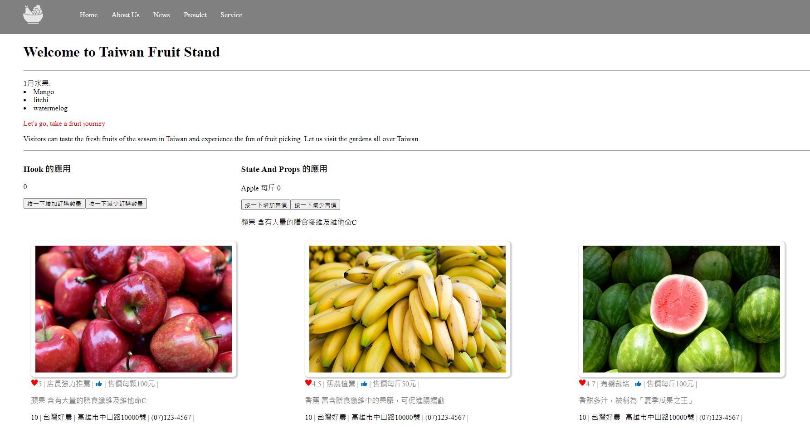
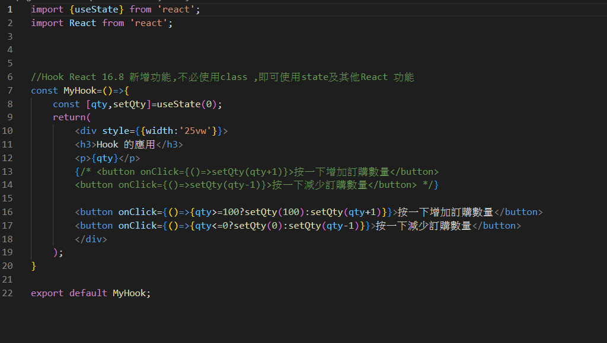
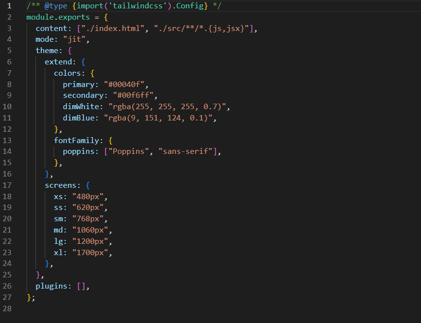
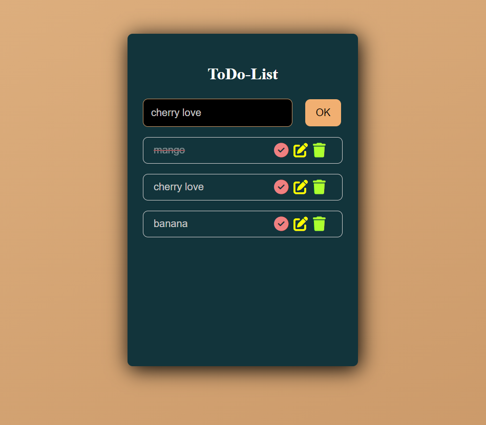
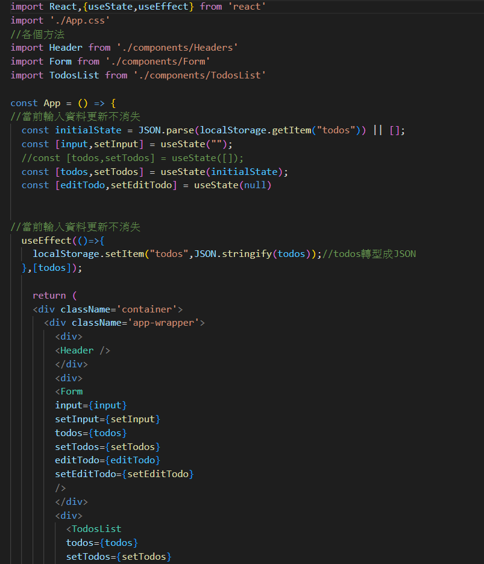
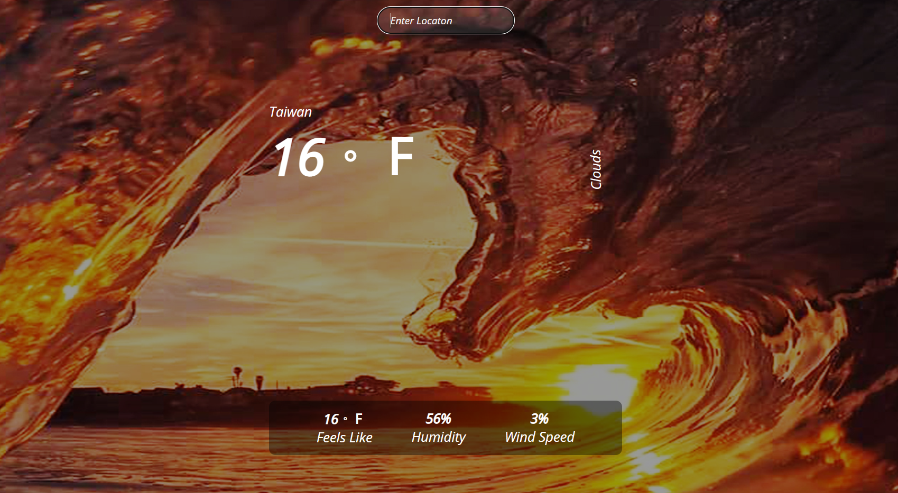
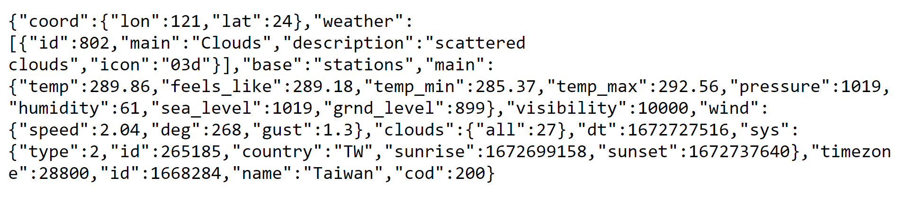

<h1 align="center"> 職訓局練習的網頁🔋 </h1>

- ## Reactpage🔋

 <strong>學習建立React,hooks的運用 

<h1 align="center"> 自學,參考來至Youtube🔋 </h1>

- ## Reactweb🔋

 <strong>學習Taiwindcss使用方式 

- ## React_todo🔋

 <strong>使用hook建立Todolist 

- ## Weather-API🔋

 <strong>React串接Weather-API 

